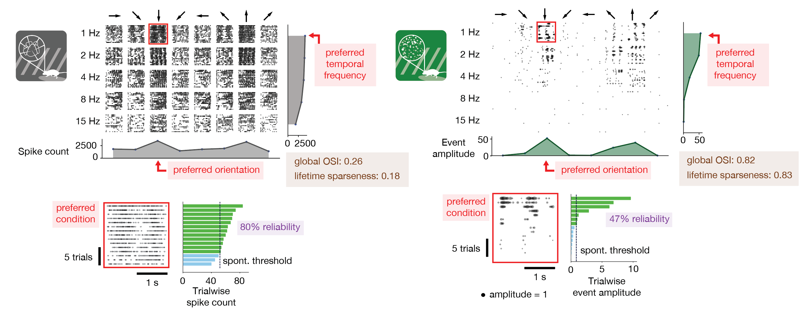

# Ophys Ephys Comparison Paper



Code for generating figures from Siegle, Ledochowitsch et al. (2021) *eLife*.

## Overview

This repository contains figure-creation scripts for the Allen Institute publication comparing
the results of large-scale electrophysiology ("ephys") and optophysiology ("ophys") datasets.


## Usage instructions

These scripts require a custom branch of the AllenSDK, available at:

[github.com/jsiegle/AllenSDK/tree/ophys-ephys](https://github.com/jsiegle/allensdk/tree/ophys-ephys)

To install this version of the AllenSDK: 

```
$ git clone https://github.com/jsiegle/AllenSDK
$ cd AllenSDK
$ git fetch origin
$ git checkout -b ophys-ephys origin/ophys-ephys
$ conda create -n ophys-ephys python=3.7
$ conda activate ophys-ephys
(ophys-ephys) $ pip install .
```
This will install the AllenSDK, as well as the necessary dependencies, such as `numpy`, `scipy`, and `pandas`.

The scripts were written using the [Spyder IDE](https://www.spyder-ide.org/), and running
them inside Spyder is strongly recommended.

To install and run Spyder:

```
(ophys-ephys) $ conda install spyder
(ophys-ephys) $ spyder &
```

The repository includes a `.spyproject` directory, which means all of the files can be easily
accessed by opening the `ophys_ephys_comparison_paper` folder via Spyder's "Projects > Open Project..."
menu.

All of the cells within each script should be executable once the Python `home` directory is set to the `ophys_ephys_comparison_paper` folder.

## Data dependencies

The scripts depend on approximately 1.7 GB of intermediate data files that live inside
the `data` directory. These can be downloaded via the following link:

[`data` directory on Dropbox](https://www.dropbox.com/sh/jsqf8yii8hir0ma/AADRBF0gx53cPTxztNARlOjOa?dl=0)


## Contact info

For more information about this repository, contact [joshs@alleninstitute.org](mailto:joshs@alleninstitute.org)


## Terms of use

See [Allen Institute Terms of Use](https://alleninstitute.org/legal/terms-use/)

© 2021 Allen Institute

